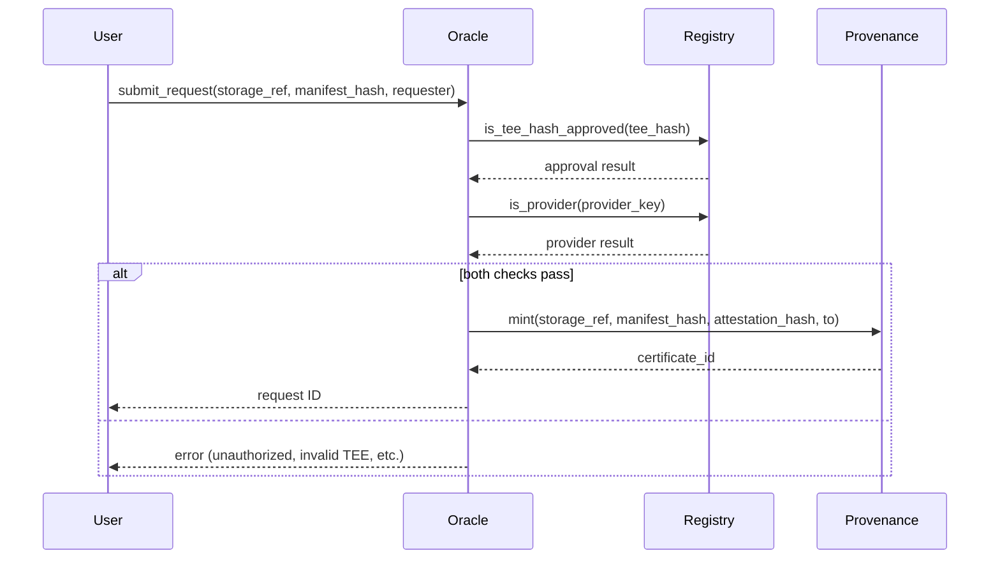

# Contract Implementation Documentation

This document explains the architecture, storage layout, cross-contract call patterns, and error handling conventions for the Stellar Veriphy smart contracts.

## Storage Key Conventions

Contracts use the `DataKey` enum to define storage keys. There are two main patterns:

1. **Simple variants**: For singleton values or simple mappings.
   ```rust
   #[contracttype]
   pub enum DataKey {
       Registry,
       Provenance,
       Admin,
   }
   ```

2. **Parameterized variants**: For mappings that require parameters (e.g., addresses, hashes).
   - Using tuple variants: `Provider(Address)` or `TeeHash(BytesN<32>)`
   - Using composite keys: In the provenance contract, tuples like `(symbol_short!("MANI"), manifest_hash)` are used for reverse lookups.

**Temporary vs Persistent Storage**:
- **Temporary storage**: Used for short-lived data with automatic expiration (TTL). Example: Oracle contract stores requests in temporary storage with a TTL of 100 ledgers.
- **Persistent storage**: Used for long-lived data (e.g., configuration, balances, certificates). No automatic expiration.

## TTL Strategy

The Oracle contract implements a TTL strategy for verification requests:
- Constant `REQUEST_TTL_LEDGERS` set to 100 ledgers.
- When storing a request in temporary storage, `extend_ttl` is called with the same value for both threshold and extension.
- This ensures requests are automatically removed after 100 ledgers if not processed.

Other contracts (Registry, Provenance) use persistent storage for their core data and do not implement explicit TTL strategies, as the data is intended to be long-lived.

## Cross-Contract Call Patterns

Contracts interact via synchronous invocations using `Env::invoke_contract` or generated client stubs.

### Oracle → Registry
The Oracle contract makes two types of calls to the Registry contract:
1. **Check TEE hash approval**:
   ```rust
   let registry: Address = env.storage().instance().get(&DataKey::Registry)?;
   let approved: bool = env.invoke_contract(
       &registry,
       &Symbol::new(&env, "is_tee_hash_approved"),
       vec![&env, tee_hash.into()],
   );
   ```
2. **Check provider authorization**:
   ```rust
   let provider_ok: bool = env.invoke_contract(
       &registry,
       &Symbol::new(&env, "is_provider"),
       vec![&env, provider.clone().into()],
   );
   ```

### Registry → Provenance
The Registry contract uses a generated client stub for type-safe cross-contract calls:
1. **Client definition** (in registry/src/lib.rs):
   ```rust
   mod provenance {
       use soroban_sdk::{contractclient, contracttype, Address, Bytes, Env};

       #[contractclient(name = "ProvenanceClient")]
       pub trait ProvenanceContract {
           fn mint(
               env: Env,
               storage_ref: Bytes,
               manifest_hash: Bytes,
               attestation_hash: Bytes,
               to: Address,
           ) -> u64;
       }
   }
   ```
2. **Usage**:
   ```rust
   let provenance_id: Address = env.storage().instance().get(&DataKey::Provenance)?;
   let client = provenance::ProvenanceClient::new(&env, &provenance_id);
   let cert_id = client.mint(&content, &empty, &empty, &owner);
   ```

## Error Enum Conventions

All contracts define errors using the `#[contracterror]` attribute on an enum:
- Derive `Copy, Clone, Debug, Eq, PartialEq` for pattern matching and logging.
- Error discriminants are explicitly numbered (starting from 1) to ensure stability.
- Example from Oracle contract:
  ```rust
  #[contracterror]
  #[derive(Copy, Clone, Debug, Eq, PartialEq)]
  pub enum Error {
      NotInitialized        = 1,
      UnauthorizedSigner    = 2,
      AlreadyInitialized    = 3,
      RegistryNotConfigured = 4,
      TeeNotVerified        = 5,
      ProviderNotRegistered = 6,
  }
  ```
- The Provenance contract returns `Result` from `get_certificate` to avoid panics for expected errors (e.g., `CertificateNotFound`).

## Event Emission Patterns

Contracts emit events using the `#[contractevent]` attribute:
- Define a struct with fields, marking topics with `#[topic]` (up to 4 topics).
- Emit using `.emit(&env)`.
- Example from Provenance contract:
  ```rust
  #[contractevent]
  pub struct CertificateMinted {
      #[topic]
      pub owner: Address,
      #[topic]
      pub certificate_id: u64,
      #[topic]
      pub manifest_hash: String,
  }
  ```
  ```rust
  CertificateMinted {
      owner: to,
      certificate_id: id,
      manifest_hash,
  }
  .emit(&env);
  ```
- The Oracle contract uses a simpler pattern for events (single topic):
  ```rust
  env.events().publish((Symbol::new(&env, "submitted"),), id);
  ```

## Cross-Contract Call Flow Diagram

The following diagram illustrates the typical flow for a verification request from Oracle to Registry to Provenance:



Note: The actual flow may vary based on the specific function being called (e.g., `verify_attestation` in Oracle involves both TEE and provider checks before proceeding).

