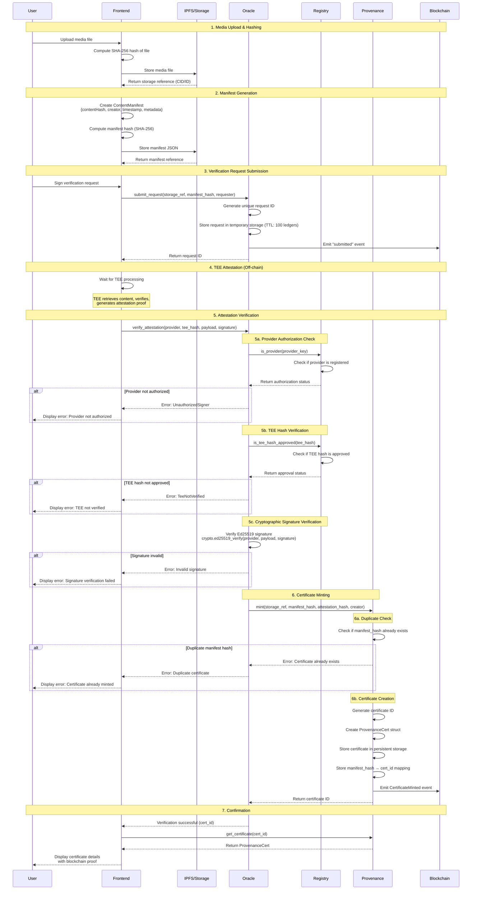

# Verification Pipeline Architecture

This document describes the end-to-end verification pipeline in StellarVeriphy, from media upload to on-chain certificate minting. The pipeline ensures cryptographic proof that digital content has not been altered and that its metadata is authentic.

## Table of Contents

- [Overview](#overview)
- [Pipeline Flow Diagram](#pipeline-flow-diagram)
- [Pipeline Steps](#pipeline-steps)
- [Contract Interactions](#contract-interactions)
- [Error States and Handling](#error-states-and-handling)
- [Retry Behavior](#retry-behavior)
- [Security Considerations](#security-considerations)

---

## Overview

The StellarVeriphy verification pipeline is a multi-stage process that transforms user-uploaded media into an immutable on-chain provenance certificate. The pipeline involves:

1. **Frontend**: User interface for media upload and manifest creation
2. **Oracle Contract**: Verification request management and TEE attestation validation
3. **Registry Contract**: Authorization checks for TEE hashes and oracle providers
4. **Provenance Contract**: Certificate minting and storage

The pipeline ensures that:
- Content integrity is cryptographically verified
- Only authorized providers can attest to verification
- Only approved TEE (Trusted Execution Environment) code can perform verification
- All verification results are immutably recorded on-chain

---

## Pipeline Flow Diagram



---

## Pipeline Steps

### Step 1: Media Upload & File Hashing

**Location**: Frontend

**Process**:
1. User selects a media file (image, video, document, etc.)
2. Frontend computes SHA-256 hash of the file content
3. File is uploaded to decentralized storage (IPFS) or centralized storage (MongoDB, S3)
4. Storage system returns a reference (IPFS CID or database ID)

**Output**:
- `contentHash`: SHA-256 hash of the media file (hex string)
- `storageRef`: Reference to where the file is stored

**Error Handling**:
- **File too large**: Display error, suggest compression
- **Upload failed**: Retry with exponential backoff (3 attempts)
- **Hash computation failed**: Display error, suggest browser compatibility check

---

### Step 2: Manifest Generation

**Location**: Frontend

**Process**:
1. Frontend creates a `ContentManifest` object:
   ```typescript
   {
     contentHash: "abc123...",  // From Step 1
     creator: "GXXXXXXX...",     // User's Stellar public key
     timestamp: "2026-06-01T12:00:00Z",
     metadata: {
       device: "iPhone 15 Pro",
       location: "37.7749,-122.4194",
       aiModel: "DALL-E 3"
     }
   }
   ```
2. Manifest is serialized to canonical JSON (sorted keys, no whitespace)
3. SHA-256 hash of the manifest is computed
4. Manifest is stored in the same storage system as the media

**Output**:
- `manifestHash`: SHA-256 hash of the manifest (hex string)
- `manifestRef`: Reference to stored manifest

**Error Handling**:
- **Invalid creator address**: Validate Stellar public key format
- **Missing required fields**: Display validation errors
- **Storage failed**: Retry with exponential backoff

---

### Step 3: Verification Request Submission

**Location**: Frontend → Oracle Contract

**Process**:
1. User signs the verification request using Freighter wallet
2. Frontend calls `Oracle.submit_request()`:
   ```rust
   pub fn submit_request(
       env: Env,
       storage_ref: Bytes,
       manifest_hash: Bytes,
       requester: Address,
   ) -> u64
   ```
3. Oracle contract:
   - Verifies requester signature (`requester.require_auth()`)
   - Generates unique request ID (auto-incrementing counter)
   - Creates `VerificationRequest` with state `Pending`
   - Stores request in **temporary storage** with TTL of 100 ledgers (~8.3 minutes)
   - Emits `submitted` event with request ID

**Output**:
- `requestId`: Unique identifier for tracking the verification request

**Error Handling**:
- **User rejects signature**: Display error, allow retry
- **Insufficient XLM balance**: Display error with funding instructions
- **Transaction failed**: Parse error, display user-friendly message
- **Network timeout**: Retry transaction (user confirmation required)

---

### Step 4: TEE Attestation (Off-chain)

**Location**: Off-chain TEE (Trusted Execution Environment)

**Process**:
1. TEE service monitors blockchain for `submitted` events
2. TEE retrieves media file and manifest from storage using references
3. TEE verifies:
   - Content hash matches the actual file
   - Manifest hash matches the manifest content
   - Metadata is consistent (optional checks)
4. TEE generates attestation proof:
   - Creates payload with verification results
   - Signs payload with TEE's private key (Ed25519)
   - Produces attestation hash

**Output**:
- `attestationProof`: Signed attestation from TEE
- `attestationHash`: Hash of the attestation proof
- `teeHash`: Hash of the TEE code that performed verification
- `signature`: Ed25519 signature over the payload

**Error Handling**:
- **Content not found**: TEE marks request as failed
- **Hash mismatch**: TEE marks request as rejected
- **TEE failure**: Request expires after TTL (100 ledgers)

---

### Step 5: Attestation Verification

**Location**: Frontend → Oracle Contract → Registry Contract

**Process**:
1. Frontend receives attestation proof from TEE (via polling or webhook)
2. Frontend calls `Oracle.verify_attestation()`:
   ```rust
   pub fn verify_attestation(
       env: Env,
       provider: BytesN<32>,
       tee_hash: BytesN<32>,
       payload: Bytes,
       signature: BytesN<64>,
   ) -> Result<(), Error>
   ```

#### Step 5a: Provider Authorization Check
3. Oracle calls `Registry.is_provider(provider_key)`:
   - Registry checks if provider public key is registered
   - Returns `true` if authorized, `false` otherwise
4. If provider not authorized, return `Error::UnauthorizedSigner`

#### Step 5b: TEE Hash Verification
5. Oracle calls `Registry.is_tee_hash_approved(tee_hash)`:
   - Registry checks if TEE code hash is in approved list
   - Returns `true` if approved, `false` otherwise
6. If TEE hash not approved, return `Error::TeeNotVerified`

#### Step 5c: Cryptographic Signature Verification
7. Oracle verifies Ed25519 signature:
   ```rust
   env.crypto().ed25519_verify(&provider, &payload, &signature);
   ```
8. If signature invalid, transaction panics (signature verification failure)

**Output**:
- `Ok(())` if all checks pass
- `Err(Error)` if any check fails

**Error Handling**:
- **UnauthorizedSigner**: Provider not registered in Registry
- **TeeNotVerified**: TEE code hash not approved
- **Invalid signature**: Cryptographic verification failed
- **NotInitialized**: Oracle contract not properly initialized
- **RegistryNotConfigured**: Registry address not set

---

### Step 6: Certificate Minting

**Location**: Oracle Contract → Provenance Contract

**Process**:
1. After successful attestation verification, Oracle calls `Provenance.mint()`:
   ```rust
   pub fn mint(
       env: Env,
       storage_ref: String,
       manifest_hash: String,
       attestation_hash: String,
       to: Address,
   ) -> u64
   ```

#### Step 6a: Duplicate Check
2. Provenance contract checks if `manifest_hash` already exists:
   ```rust
   let mani_key = (symbol_short!("MANI"), manifest_hash.clone());
   if env.storage().persistent().has(&mani_key) {
       panic!("Certificate already exists for this manifest hash");
   }
   ```
3. If duplicate found, transaction panics

#### Step 6b: Certificate Creation
4. Provenance contract:
   - Generates unique certificate ID (auto-incrementing counter)
   - Creates `ProvenanceCert` struct:
     ```rust
     ProvenanceCert {
         storage_ref,
         manifest_hash,
         attestation_hash,
         creator: to,
         timestamp: env.ledger().timestamp(),
     }
     ```
   - Stores certificate in **persistent storage** (permanent)
   - Stores reverse mapping: `manifest_hash → certificate_id`
   - Emits `CertificateMinted` event with topics:
     - `owner`: Certificate owner address
     - `certificate_id`: Unique certificate ID
     - `manifest_hash`: Manifest hash for indexing

**Output**:
- `certificateId`: Unique on-chain certificate identifier

**Error Handling**:
- **Duplicate certificate**: Panic with message "Certificate already exists"
- **Not initialized**: Panic with message "Not initialized"
- **Unauthorized caller**: Only Oracle can mint (enforced by `oracle.require_auth()`)

---

### Step 7: Confirmation & Display

**Location**: Frontend

**Process**:
1. Frontend receives successful transaction result with `certificate_id`
2. Frontend calls `Provenance.get_certificate(cert_id)` to retrieve full certificate
3. Certificate details are displayed to user:
   - Certificate ID
   - Storage reference (link to view media)
   - Manifest hash
   - Attestation hash
   - Creator address
   - Timestamp
   - Blockchain transaction hash (proof of immutability)

**Output**:
- User-friendly certificate display
- Shareable certificate URL
- Downloadable certificate JSON

**Error Handling**:
- **Certificate not found**: Should not occur if minting succeeded
- **Network error**: Retry fetching certificate details

---

## Contract Interactions

### Oracle → Registry Interactions

The Oracle contract makes two types of calls to the Registry:

1. **Check TEE Hash Approval**:
   ```rust
   let registry: Address = env.storage().instance()
       .get(&DataKey::Registry)
       .ok_or(Error::RegistryNotConfigured)?;
   
   let approved: bool = env.invoke_contract(
       &registry,
       &Symbol::new(&env, "is_tee_hash_approved"),
       vec![&env, tee_hash.into()],
   );
   ```

2. **Check Provider Authorization**:
   ```rust
   let provider_ok: bool = env.invoke_contract(
       &registry,
       &Symbol::new(&env, "is_provider"),
       vec![&env, provider.clone().into()],
   );
   ```

### Oracle → Provenance Interaction

The Oracle contract (or Registry in some flows) calls Provenance to mint certificates:

```rust
// Using generated client (type-safe)
let provenance_id: Address = env.storage().instance()
    .get(&DataKey::Provenance)
    .expect("Not initialized");

let client = ProvenanceClient::new(&env, &provenance_id);
let cert_id = client.mint(
    &storage_ref,
    &manifest_hash,
    &attestation_hash,
    &owner
);
```

### Registry → Provenance Interaction

The Registry contract also has a `verify_and_mint` function that directly calls Provenance:

```rust
pub fn verify_and_mint(
    env: Env,
    content: Bytes,
    expected_hash: BytesN<32>,
    owner: Address,
) -> VerificationResult
```

This function:
1. Computes SHA-256 hash of content
2. Compares with expected hash
3. If match, calls `Provenance.mint()`
4. Returns `VerificationResult` with success status and certificate ID

---

## Error States and Handling

### Oracle Contract Errors

| Error Code | Error Name | Description | Recovery Action |
|------------|------------|-------------|-----------------|
| 1 | `NotInitialized` | Contract not initialized with Registry/Provenance addresses | Admin must call `init()` |
| 2 | `UnauthorizedSigner` | Provider public key not registered in Registry | Admin must call `Registry.add_provider()` |
| 3 | `AlreadyInitialized` | Attempting to initialize contract twice | No action needed, contract is ready |
| 4 | `RegistryNotConfigured` | Registry address not set in storage | Admin must reinitialize contract |
| 5 | `TeeNotVerified` | TEE code hash not approved in Registry | Admin must call `Registry.add_tee_hash()` |
| 6 | `ProviderNotRegistered` | Provider not found in Registry | Admin must register provider |

### Provenance Contract Errors

| Error Code | Error Name | Description | Recovery Action |
|------------|------------|-------------|-----------------|
| 1 | `CertificateNotFound` | Certificate ID does not exist | Verify certificate ID is correct |
| - | `AlreadyInitialized` (panic) | Contract already initialized | No action needed |
| - | `DuplicateManifest` (panic) | Certificate already exists for manifest hash | Use existing certificate |
| - | `NotInitialized` (panic) | Contract not initialized | Admin must call `initialize()` |
| - | `Unauthorized` (panic) | Caller is not the Oracle contract | Only Oracle can mint certificates |

### Registry Contract Errors

| Error | Description | Recovery Action |
|-------|-------------|-----------------|
| `AlreadyInitialized` (panic) | Contract already initialized | No action needed |
| `NotInitialized` (panic) | Contract not initialized | Admin must call `init()` |
| `Unauthorized` (panic) | Non-admin attempting admin operation | Use admin account |

### Frontend Error Handling

| Error Type | User Message | Technical Action |
|------------|--------------|------------------|
| Wallet not connected | "Please connect your Freighter wallet" | Prompt wallet connection |
| Insufficient balance | "Insufficient XLM balance. Please fund your account." | Show funding instructions |
| User rejected signature | "Transaction cancelled by user" | Allow retry |
| Network timeout | "Network timeout. Please try again." | Retry with exponential backoff |
| Invalid file format | "Unsupported file format" | Show supported formats |
| File too large | "File exceeds maximum size (10MB)" | Suggest compression |
| Provider not authorized | "Verification provider not authorized. Please contact support." | Log error, show support contact |
| TEE not verified | "TEE verification failed. Please contact support." | Log error, show support contact |
| Duplicate certificate | "A certificate already exists for this content" | Show existing certificate |
| Hash mismatch | "Content verification failed: hash mismatch" | Suggest re-upload |

---

## Retry Behavior

### Frontend Retry Strategy

The frontend implements exponential backoff for transient failures:

```typescript
async function retryWithBackoff<T>(
  fn: () => Promise<T>,
  maxRetries: number = 3,
  baseDelay: number = 1000
): Promise<T> {
  for (let i = 0; i < maxRetries; i++) {
    try {
      return await fn();
    } catch (error) {
      if (i === maxRetries - 1) throw error;
      
      const delay = baseDelay * Math.pow(2, i);
      await new Promise(resolve => setTimeout(resolve, delay));
    }
  }
  throw new Error('Max retries exceeded');
}
```

**Retry Scenarios**:

1. **File Upload to IPFS/Storage**:
   - Max retries: 3
   - Base delay: 1 second
   - Exponential backoff: 1s, 2s, 4s

2. **Blockchain Transaction Submission**:
   - Max retries: 2 (requires user confirmation for each retry)
   - Base delay: 2 seconds
   - User must approve each retry

3. **Certificate Retrieval**:
   - Max retries: 5
   - Base delay: 500ms
   - Exponential backoff: 0.5s, 1s, 2s, 4s, 8s

4. **TEE Attestation Polling**:
   - Max retries: 60 (10 minutes with 10-second intervals)
   - Base delay: 10 seconds
   - No exponential backoff (constant polling)
   - Timeout after 10 minutes

### Smart Contract Retry Strategy

Smart contracts do **not** implement automatic retries. Failed transactions must be retried by the caller (frontend or off-chain service).

**Non-Retryable Errors** (require manual intervention):
- `UnauthorizedSigner`: Admin must register provider
- `TeeNotVerified`: Admin must approve TEE hash
- `DuplicateManifest`: Certificate already exists (use existing)
- `NotInitialized`: Admin must initialize contract

**Retryable Errors** (can be retried after fixing):
- Network timeouts: Retry transaction
- Insufficient balance: Fund account, then retry
- Nonce errors: Wait for pending transactions, then retry

### TEE Service Retry Strategy

The off-chain TEE service implements its own retry logic:

1. **Content Retrieval from Storage**:
   - Max retries: 5
   - Base delay: 2 seconds
   - Exponential backoff

2. **Blockchain Event Monitoring**:
   - Continuous polling with reconnection logic
   - Reconnect on WebSocket disconnect
   - Resume from last processed block

3. **Attestation Submission**:
   - Max retries: 3
   - Base delay: 5 seconds
   - Exponential backoff

---

## Security Considerations

### 1. Authorization Layers

The pipeline implements multiple authorization checks:

- **User Authorization**: User must sign transactions with their Stellar account
- **Provider Authorization**: Only registered providers can submit attestations
- **TEE Authorization**: Only approved TEE code hashes are accepted
- **Oracle Authorization**: Only the Oracle contract can mint certificates

### 2. Cryptographic Verification

All critical operations use cryptographic verification:

- **Content Integrity**: SHA-256 hashing ensures content hasn't been altered
- **Manifest Integrity**: SHA-256 hashing ensures manifest hasn't been altered
- **Attestation Authenticity**: Ed25519 signature verification proves attestation origin
- **Blockchain Immutability**: Stellar consensus ensures certificate permanence

### 3. Duplicate Prevention

The Provenance contract prevents duplicate certificates:

```rust
let mani_key = (symbol_short!("MANI"), manifest_hash.clone());
if env.storage().persistent().has(&mani_key) {
    panic!("Certificate already exists for this manifest hash");
}
```

This ensures:
- One certificate per unique manifest
- No replay attacks
- No certificate spam

### 4. Temporary Storage for Requests

The Oracle contract uses temporary storage with TTL for verification requests:

- **Automatic Cleanup**: Requests expire after 100 ledgers (~8.3 minutes)
- **Storage Efficiency**: Prevents storage bloat from abandoned requests
- **DoS Prevention**: Limits impact of spam requests

### 5. Access Control

All admin operations require authentication:

```rust
let admin: Address = env.storage().instance()
    .get(&DataKey::Admin)
    .expect("Not initialized");
admin.require_auth();
```

This ensures:
- Only admin can register providers
- Only admin can approve TEE hashes
- Only admin can initialize contracts

### 6. Input Validation

Contracts validate all inputs:

- **Address validation**: Stellar addresses must be valid
- **Hash validation**: Hashes must be correct length (32 bytes for SHA-256)
- **Signature validation**: Ed25519 signatures must be 64 bytes
- **Non-empty checks**: Required fields must not be empty

---

## Conclusion

The StellarVeriphy verification pipeline provides a robust, secure, and transparent system for digital content verification. By combining off-chain efficiency with on-chain immutability, the pipeline ensures that provenance certificates are trustworthy, auditable, and permanent.

Key strengths:
- **Multi-layer authorization**: Provider, TEE, and user authorization
- **Cryptographic integrity**: SHA-256 hashing and Ed25519 signatures
- **Duplicate prevention**: One certificate per unique manifest
- **Automatic cleanup**: Temporary storage with TTL
- **Comprehensive error handling**: Clear error states and recovery actions
- **Retry resilience**: Exponential backoff for transient failures

For more information:
- [Contract Implementation Details](../IMPLEMENTATION.md)
- [Deployment Guide](../DEPLOYMENT.md)
- [Contributing Guide](../CONTRIBUTING.md)
